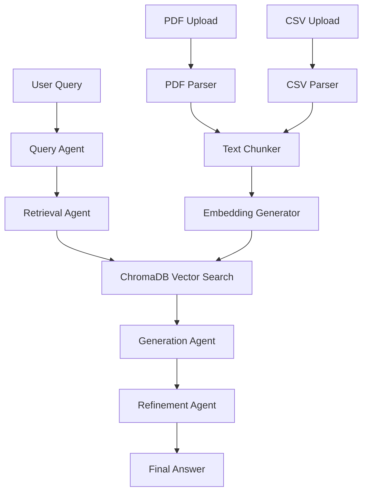

# RAG Application

**Retrieval-Augmented Generation Application with Langgraph, FastAPI, and ChromaDB**

A production-ready RAG (Retrieval-Augmented Generation) application that supports PDF and CSV document ingestion, intelligent query processing, and multi-step agent workflows using Langgraph.

## 🏗️ Architecture

The application uses Langgraph to orchestrate a sophisticated multi-step RAG workflow:

1. **Query Classification**: Analyzes user queries and determines intent
2. **Context Retrieval**: Performs vector similarity search in ChromaDB
3. **Answer Generation**: Uses LLM to generate answers from retrieved context
4. **Answer Refinement**: Refines and validates the generated response



## 🛠️ Tech Stack

- **Python 3.11+**: Latest Python features
- **FastAPI**: Modern, fast web framework
- **Langgraph**: Agent orchestration and workflow management
- **LangChain**: LLM integration and RAG capabilities
- **ChromaDB**: Vector database for embeddings
- **OpenAI**: LLM and embeddings (GPT-4, text-embedding-3-small)

## 📁 Project Structure

```
OmniHelp/
├── backend/
│   ├── app/
│   │   ├── agents/              # Langgraph agents
│   │   │   ├── query_agent.py   # Query classification
│   │   │   ├── retrieval_agent.py # Vector search
│   │   │   ├── generation_agent.py # Answer generation
│   │   │   ├── refinement_agent.py # Answer refinement
│   │   │   └── orchestrator.py  # Main workflow
│   │   ├── api/                 # FastAPI routes
│   │   │   └── v1/
│   │   │       ├── documents.py # Document upload endpoints
│   │   │       └── query.py     # Query endpoints
│   │   ├── core/                # Configuration
│   │   │   ├── config.py        # Settings
│   │   │   └── dependencies.py  # Shared dependencies
│   │   ├── db/                  # Database layer
│   │   │   └── chroma.py        # ChromaDB client
│   │   ├── models/              # Data models
│   │   │   ├── document.py
│   │   │   └── query.py
│   │   ├── services/            # Business logic
│   │   │   ├── document_service.py
│   │   │   ├── chunking_service.py
│   │   │   └── embedding_service.py
│   │   ├── utils/               # Utilities
│   │   │   ├── logger.py
│   │   │   └── parsers.py
│   │   └── main.py              # FastAPI app
│   ├── requirements.txt
│   └── .gitignore
├── tests/                       # Test suite
│   ├── test_agents.py
│   ├── test_services.py
│   └── test_api.py
└── README.md
```

## 🚀 Getting Started

### Prerequisites

- Python 3.11 or higher
- OpenAI API key
- pip (Python package manager)

### Installation

1. **Clone or navigate to the project directory:**
   ```bash
   cd OmniHelp/backend
   ```

2. **Create virtual environment:**
   ```bash
   python -m venv venv
   source venv/bin/activate  # On Windows: venv\Scripts\activate
   ```

3. **Install dependencies:**
   ```bash
   pip install -r requirements.txt
   ```

4. **Configure environment variables:**
   
   Create a `.env` file in the `backend/` directory:
   ```env
   OPENAI_API_KEY=your_openai_api_key_here
   OPENAI_MODEL=gpt-4o-mini
   OPENAI_EMBEDDING_MODEL=text-embedding-3-small
   CHROMA_DB_PATH=./data/chroma_db
   CHUNK_SIZE=1000
   CHUNK_OVERLAP=200
   ```

5. **Create data directories:**
   ```bash
   mkdir -p data/documents data/chroma_db logs
   ```

6. **Run the application:**
   ```bash
   python -m app.main
   ```
   
   Or using uvicorn directly:
   ```bash
   uvicorn app.main:app --reload --host 0.0.0.0 --port 8000
   ```

   The API will be available at `http://localhost:8000`
   - API Documentation: `http://localhost:8000/docs`
   - ReDoc: `http://localhost:8000/redoc`

## 📖 Usage

### 1. Upload Documents

**Upload a PDF:**
```bash
curl -X POST "http://localhost:8000/api/v1/documents/upload" \
  -F "file=@document.pdf"
```

**Upload a CSV:**
```bash
curl -X POST "http://localhost:8000/api/v1/documents/upload" \
  -F "file=@data.csv"
```

**Response:**
```json
{
  "document_id": "uuid-here",
  "filename": "document.pdf",
  "document_type": "pdf",
  "chunks": 45,
  "file_path": "./data/documents/uuid_document.pdf"
}
```

### 2. Query Documents

**Submit a query:**
```bash
curl -X POST "http://localhost:8000/api/v1/query" \
  -H "Content-Type: application/json" \
  -d '{
    "query": "What is machine learning?",
    "n_results": 5
  }'
```

**Response:**
```json
{
  "answer": "Machine learning is...",
  "sources": ["document.pdf", "another.pdf"],
  "retrieved_chunks": [...],
  "metadata": {
    "refined": true,
    "sources_count": 2
  }
}
```

### 3. List Documents

```bash
curl -X GET "http://localhost:8000/api/v1/documents/"
```

### 4. Delete Document

```bash
curl -X DELETE "http://localhost:8000/api/v1/documents/{document_id}"
```

## 🔄 How It Works

### Document Processing Flow

1. **Upload**: PDF or CSV file is uploaded via API
2. **Parsing**: 
   - PDF: Text extraction using pypdf
   - CSV: Each row converted to text with column context
3. **Chunking**: Text split into chunks (configurable size/overlap)
4. **Embedding**: Generate embeddings using OpenAI
5. **Storage**: Store chunks with metadata in ChromaDB

### Query Processing Flow

1. **Query Classification**: Analyze intent and determine search strategy
2. **Retrieval**: Vector similarity search in ChromaDB
3. **Generation**: LLM generates answer from retrieved context
4. **Refinement**: Answer is refined and validated
5. **Response**: Final answer returned with sources and metadata

## 🧪 Testing

Run tests:
```bash
pytest tests/
```

Run with coverage:
```bash
pytest tests/ --cov=app --cov-report=html
```

## ⚙️ Configuration

Key configuration options in `.env`:

- `OPENAI_API_KEY`: Your OpenAI API key (required)
- `OPENAI_MODEL`: LLM model (default: gpt-4o-mini)
- `OPENAI_EMBEDDING_MODEL`: Embedding model (default: text-embedding-3-small)
- `CHROMA_DB_PATH`: Path to ChromaDB storage
- `CHUNK_SIZE`: Text chunk size (default: 1000)
- `CHUNK_OVERLAP`: Chunk overlap (default: 200)
- `MAX_FILE_SIZE_MB`: Maximum upload size (default: 50MB)

## 📝 API Endpoints

### Documents
- `POST /api/v1/documents/upload` - Upload PDF or CSV
- `GET /api/v1/documents/` - List all documents
- `DELETE /api/v1/documents/{document_id}` - Delete document

### Query
- `POST /api/v1/query` - Submit RAG query

### Health
- `GET /health` - Health check
- `GET /` - Root endpoint

## 🚧 Future Enhancements

- [ ] Support for additional file formats (DOCX, TXT, etc.)
- [ ] Advanced metadata filtering
- [ ] Query history and conversation context
- [ ] Multi-document query support
- [ ] Custom embedding models
- [ ] Document versioning
- [ ] User authentication
- [ ] Rate limiting
- [ ] Caching layer

## 📄 License

This project is part of an AI engineering demonstration.

## 🤝 Contributing

For production use, consider:
- Adding comprehensive error handling
- Implementing rate limiting
- Adding authentication/authorization
- Setting up proper logging and monitoring
- Adding more comprehensive tests
- Implementing caching strategies
- Adding document versioning

---

**Built with ❤️ using Langgraph, FastAPI, ChromaDB, and OpenAI**
