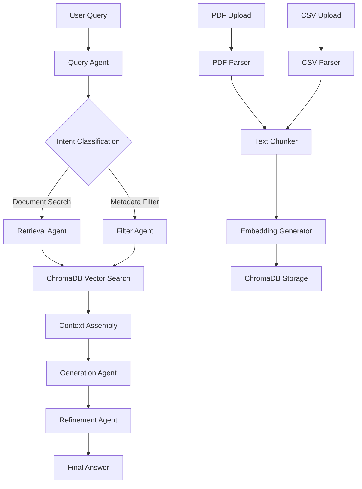

# RAG Application Project Structure

## Architecture Overview

The application will use Langgraph to orchestrate a multi-step RAG workflow: document ingestion → query processing → retrieval → answer generation with refinement capabilities.



## Project Structure

```
rag-application/
├── backend/
│   ├── app/
│   │   ├── __init__.py
│   │   ├── main.py                 # FastAPI application entry
│   │   ├── core/
│   │   │   ├── __init__.py
│   │   │   ├── config.py            # Settings and configuration
│   │   │   └── dependencies.py      # Shared dependencies
│   │   ├── agents/
│   │   │   ├── __init__.py
│   │   │   ├── query_agent.py       # Query understanding and intent
│   │   │   ├── retrieval_agent.py   # Vector search and retrieval
│   │   │   ├── generation_agent.py   # LLM answer generation
│   │   │   ├── refinement_agent.py  # Answer refinement and validation
│   │   │   └── orchestrator.py      # Main Langgraph workflow
│   │   ├── services/
│   │   │   ├── __init__.py
│   │   │   ├── document_service.py  # Document processing (PDF/CSV)
│   │   │   ├── embedding_service.py # Embedding generation
│   │   │   └── chunking_service.py  # Text chunking strategies
│   │   ├── db/
│   │   │   ├── __init__.py
│   │   │   └── chroma.py            # ChromaDB client and utilities
│   │   ├── models/
│   │   │   ├── __init__.py
│   │   │   ├── document.py         # Document data models
│   │   │   └── query.py            # Query and response models
│   │   ├── api/
│   │   │   ├── __init__.py
│   │   │   └── v1/
│   │   │       ├── __init__.py
│   │   │       ├── router.py       # Main API router
│   │   │       ├── documents.py    # Document upload/management endpoints
│   │   │       └── query.py        # Query/chat endpoints
│   │   └── utils/
│   │       ├── __init__.py
│   │       ├── logger.py           # Logging configuration
│   │       └── parsers.py           # PDF and CSV parsing utilities
│   ├── requirements.txt
│   ├── .env.example
│   ├── .gitignore
│   └── README.md
├── data/                             # Data directory (gitignored)
│   ├── documents/                    # Uploaded documents
│   └── chroma_db/                    # ChromaDB storage
├── tests/
│   ├── __init__.py
│   ├── test_agents.py
│   ├── test_services.py
│   └── test_api.py
└── README.md
```

## Key Components

### 1. Langgraph Agents ([backend/app/agents/](backend/app/agents/))

**Query Agent** (`query_agent.py`): Analyzes user queries, extracts intent, and determines search strategy.

**Retrieval Agent** (`retrieval_agent.py`): Performs vector similarity search in ChromaDB with optional metadata filtering.

**Generation Agent** (`generation_agent.py`): Uses retrieved context to generate answers via LLM.

**Refinement Agent** (`refinement_agent.py`): Refines and validates generated answers, handles follow-up questions.

**Orchestrator** (`orchestrator.py`): Main Langgraph StateGraph that coordinates all agents in a multi-step workflow.

### 2. Document Processing ([backend/app/services/](backend/app/services/))

**Document Service** (`document_service.py`): Handles PDF and CSV uploads, routes to appropriate parsers, manages document metadata.

**Chunking Service** (`chunking_service.py`): Implements text chunking strategies (RecursiveCharacterTextSplitter, semantic chunking) with configurable chunk size and overlap.

**Embedding Service** (`embedding_service.py`): Generates embeddings using OpenAI or local models, batches processing for efficiency.

### 3. Database Layer ([backend/app/db/](backend/app/db/))

**ChromaDB Client** (`chroma.py`): Manages ChromaDB connection, collection creation, document storage with metadata (source, type, upload_date).

### 4. API Endpoints ([backend/app/api/v1/](backend/app/api/v1/))

**Documents API** (`documents.py`):

- `POST /api/v1/documents/upload` - Upload PDF or CSV
- `GET /api/v1/documents` - List all documents
- `DELETE /api/v1/documents/{doc_id}` - Delete document

**Query API** (`query.py`):

- `POST /api/v1/query` - Submit RAG query
- `GET /api/v1/query/history` - Query history (optional)

### 5. Configuration ([backend/app/core/](backend/app/core/))

**Config** (`config.py`): Pydantic settings for:

- OpenAI API key and model selection
- ChromaDB path and collection name
- Chunking parameters (size, overlap)
- Embedding model configuration
- File upload limits

## Implementation Details

### Document Processing Flow

1. **PDF Processing**: Use `pypdf` or `pdfplumber` to extract text, preserve structure if needed
2. **CSV Processing**: Convert each row to a text chunk with column names as context (e.g., "Product: X, Price: Y, Category: Z")
3. **Chunking**: Apply RecursiveCharacterTextSplitter with configurable parameters
4. **Embedding**: Generate embeddings for all chunks
5. **Storage**: Store in ChromaDB with metadata (source file, chunk index, document type)

### Langgraph Workflow

The orchestrator implements a state machine with these nodes:

- `classify_query` → `retrieve_context` → `generate_answer` → `refine_answer` → `finalize_response`

State includes: query, intent, retrieved_chunks, context, generated_answer, refined_answer, sources, metadata.

### FastAPI Application

Main application (`app/main.py`) will:

- Initialize ChromaDB on startup
- Configure CORS for API access
- Include API routers
- Set up logging
- Provide health check endpoint

## Dependencies

Key packages in `requirements.txt`:

- `fastapi`, `uvicorn` - Web framework
- `langgraph`, `langchain` - Agent orchestration
- `langchain-openai` - LLM integration
- `chromadb` - Vector database
- `pypdf` or `pdfplumber` - PDF parsing
- `pandas` - CSV processing
- `pydantic`, `pydantic-settings` - Configuration
- `python-multipart` - File uploads
- `loguru` - Logging

## File Organization Principles

- **Separation of concerns**: Agents, services, API, and database layers are distinct
- **Modularity**: Each agent is independently testable
- **Extensibility**: Easy to add new document types or agents
- **Configuration-driven**: All settings externalized via environment variables